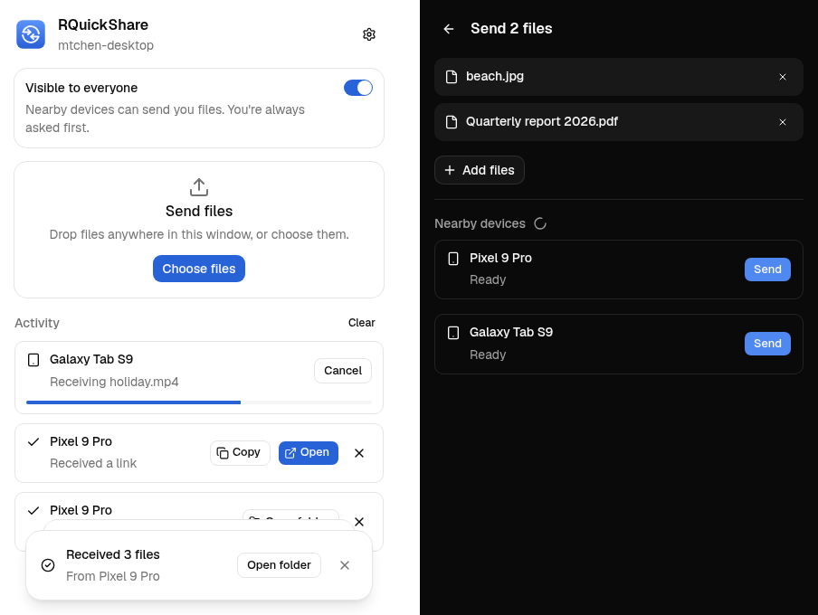

<div align="center">
  
  <h1>RQuickShare</h1>
  <p><strong>Quick Share (Nearby Share) for Linux</strong></p>

[](https://github.com/mtch3n/quickshare/actions/workflows/build.yml)
</div>

Send and receive files, links and text between Linux and Android over Google's
Quick Share protocol.

This is a maintained fork of [Martichou/rquickshare](https://github.com/Martichou/rquickshare),
which is no longer updated.



## Install

Download the AppImage from [Releases](https://github.com/mtch3n/quickshare/releases):

- **Latest release**: tagged versions.
- **Nightly**: built from every commit on `master`.

```bash
chmod +x RQuickShare-*.AppImage
./RQuickShare-*.AppImage
```

AppImages need FUSE 2 (`fuse2` on Arch, `libfuse2` on Debian/Ubuntu).

## Using it

- **Receive**: leave the app (or its tray icon) running and keep *Visible to
  everyone* on. Each incoming transfer asks for your confirmation. Check that
  the PIN matches the one on the phone.
- **Send**: drop files on the window or click *Choose files*, then pick a
  nearby device.
- **From your file manager**: turn on *Settings → File manager menu*. This
  adds *Send with Quick Share* to the right-click menu of Files (Nautilus),
  Dolphin and Nemo. Files needs the `nautilus-python` package
  (`python-nautilus` on Arch). You can also run `RQuickShare-*.AppImage --send FILE...`.
- **In the background**: closing the window keeps the app in the tray. On GNOME
  that needs the *AppIndicator and KStatusNotifierItem Support* extension.

## Protocol support

| Feature | Status |
| --- | --- |
| Receive files, links, text, Wi-Fi credentials | ✅ |
| Send files | ✅ |
| Send text / links | ✅ |
| Send folders | ✅ |
| Wi-Fi LAN transport (mDNS + TCP) | ✅ |
| Bluetooth LE wake-up, so phones notice this computer | ✅ |
| Receive over Bluetooth LE, then continue over Wi-Fi LAN | 🧪 experimental, see below |
| Send over Bluetooth, Bluetooth Classic (RFCOMM) | ❌ |
| Wi-Fi Direct / hotspot / WebRTC upgrades | ❌ |
| "Your devices" / contacts-only visibility | ❌ needs Google account certificates |
| AirDrop | ❌ see below |

**Bluetooth.** Phones that turn Wi-Fi off while picking a target (Pixel 10,
Galaxy S26 with *Share with Apple devices* on) only find this computer over
Bluetooth LE. While visible, the app advertises itself over BLE and accepts the
phone's BLE connection; once the handshake is done it asks the phone to continue
over Wi-Fi LAN, since BLE is very slow. If the phone can't reach this computer
over Wi-Fi, the transfer stays on BLE. Ported from
[martinalderson/rquickshare](https://github.com/martinalderson/rquickshare),
where it was verified on Pixels. Sending still needs Wi-Fi LAN.

**AirDrop.** Not supported, and not realistic in this app. It needs Apple's
AWDL Wi-Fi link, which on Linux only works with a few Wi-Fi chips that
support monitor mode and injection, plus Apple-signed certificates for
anything except "Everyone" mode. Pixel's AirDrop interop didn't change the
Quick Share protocol.

## FAQ

**My phone doesn't see my computer.** Both devices must be on the same Wi-Fi,
and the network must allow mDNS (guest and public networks often don't). Turn
Bluetooth on: the app watches for phones that are sharing and re-announces
itself.

**My computer doesn't see my phone.** Android only announces itself while its
Quick Share screen is open and set to *Everyone*. Keep Bluetooth on so the
phone receives our wake-up signal.

**Bluetooth audio or my mouse stutters while the app runs.** The app looks for
phones that are sharing. With `Experimental = true` in `/etc/bluetooth/main.conf`
(then restart `bluetooth.service`), BlueZ lets it listen passively, which doesn't
compete with your other devices.

**My firewall blocks transfers.** Pin the port in
`~/.local/share/dev.mandre.rquickshare/.settings.json`, for example
`"port": 12345`, then allow that TCP port and mDNS (UDP 5353). Transfers that
start over Bluetooth move to the same port.

**The window is blank.** WebKitGTK's GPU renderer is already disabled by
default. If it still happens, try `WEBKIT_DISABLE_COMPOSITING_MODE=1 ./RQuickShare-*.AppImage`.

## Building

See [BUILD.md](BUILD.md).

## Credits

- [Martichou/rquickshare](https://github.com/Martichou/rquickshare), the project this is based on
- [grishka/NearDrop](https://github.com/grishka/NearDrop) and
  [vicr123/QNearbyShare](https://github.com/vicr123/QNearbyShare), for documenting the protocol
- [nozwock/packet](https://github.com/nozwock/packet), which inspired the file manager integration
- [martinalderson/rquickshare](https://github.com/martinalderson/rquickshare), for reverse-engineering
  receiving over Bluetooth LE

Licensed under the GNU GPL v3.
